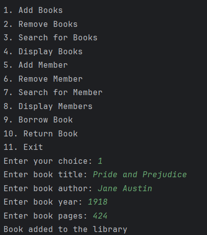

# Library Management System (CLI-based) using Python
A python based CLI Library Management System that allows users to manage books,members, and borrowing transactions efficiently using CSV files for data storage.
## Features:
* Add, remove and search for books
* register and manage library members
* Borrow and return books
* Persistent storage using csv files
* Clean and structured object-oriented design
## Installation:
To run this project you need to clone the repository and execute the main script: 
`git clone https://github.com/mohammedomer12/Library-Management-System.git` 
`cd Library-Management-System` 
`python main.py`
## How it works:

## File Structure:
Library-Management-System/
│── library.py        # Main library system script  
│── books.csv         # Stores book data  
│── members.csv       # Stores member data  
│── images            # stores the images  
│── README.md         # Project documentation  
## Future enhancements
* Track due dates for borrowed books
* Add multiple copies of books
* Generate borrowing history reports

## Author
**Mohammed Omer Siddiqui**

